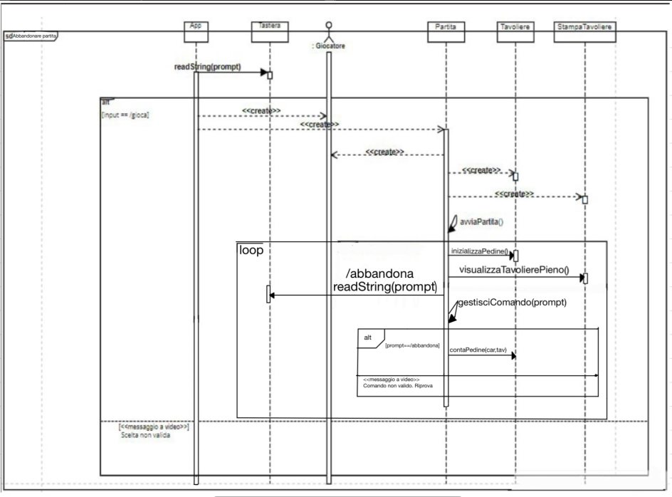
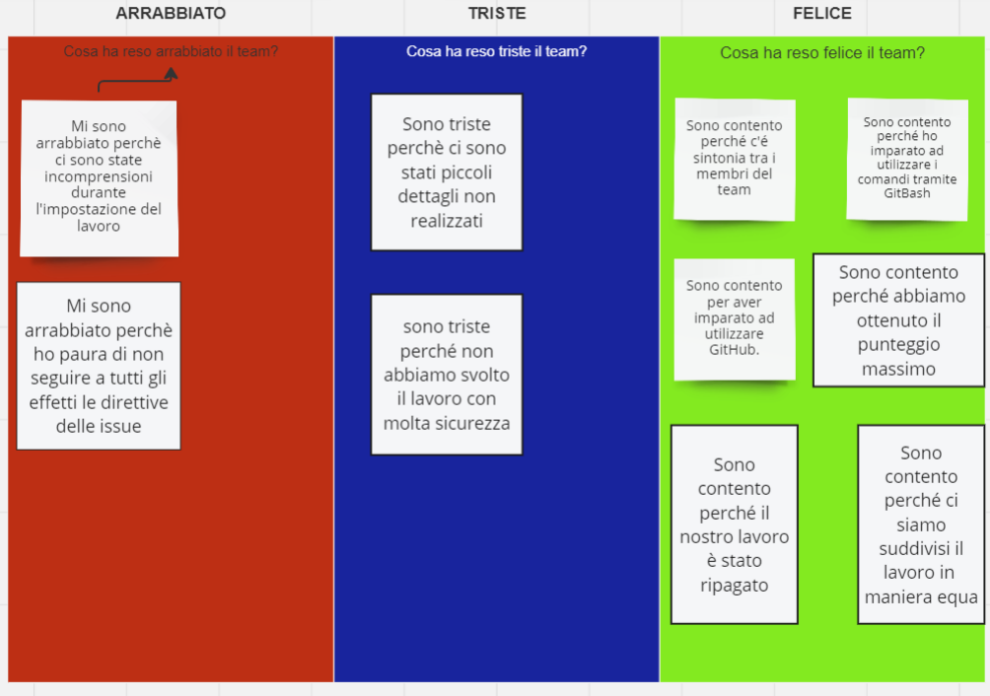

# REPORT

## **Indice**

   
1. [Introduzione](#1-introduzione)

2. [Modello di Dominio](#2-modello-di-dominio)  

3. [Requisiti Specifici](#3-requisiti-specifici)
 
    - 3.1 [Requisiti Funzionali](#31-requisiti-funzionali)

    - 3.2 [Requisiti non Funzionali](#32-requisiti-non-funzionali)

4. [System Design](#4-system-design)

   - 4.1 [Diagramma dei Package](#41-diagramma-dei-package)

   - 4.2 [Architettura dell'Applicazione](#42-architettura-dellapplicazione)

   - 4.3 [Commenti sulle Decisioni prese](#43-commenti-sulle-decisioni-prese)

5. [OO Design](#5-oo-design)

   - 5.1 [Diagramma delle Classi e di Sequenza](#51-diagramma-delle-classi-e-di-sequenza)

   - 5.2 [Principi di OO Design](#52-principi-di-oo-design)

     - 5.2.1 [Principi SOLID](#521-principi-solid)

   - 5.3 [Commento sulle decisioni prese](#53-commento-sulle-decisioni-prese)

6. [Riepilogo dei Test](#6-riepilogo-dei-test)

   - 6.1 [Strumenti di Analisi e Testing del Codice utilizzati](#61-strumenti-di-analisi-e-testing-del-codice-utilizzati)

   - 6.2 [Presentazione esiti Test e Considerazioni](#62-presentazione-esiti-test-e-considerazioni)

   - 6.3 [Descrizione test effettuati](#63-descrizione-test-effettuati) 

7. [Manuale Utente](#7-manuale-utente)

   - 7.1 [Introduzione Manuale](#71-introduzione-manuale)
 
   - 7.2 [Azioni Preliminari](#72-azioni-preliminari)
     - 7.2.1 [Installazione e configurazione Docker](#721-installazione-e-configurazione-docker)
     - 7.2.2 [Autenticazione con GitHub](#722-autenticazione-con-github)
     - 7.2.3 [Avvio dell'Applicazione](#723-avvio-dellapplicazione)

   - 7.3 [Guida ai Comandi](#73-guida-ai-comandi)
     - 7.3.1 [Come si Gioca](#731-come-si-gioca)

   - 7.4 [Glossario e Termini Chiave](#74-glossario-e-termini-chiave)

8. [Processo di Sviluppo e Organizzazione del Lavoro](#8-processo-di-sviluppo-e-organizzazione-del-lavoro)

   - 8.1 [Introduzione Processo di Sviluppo](#81-introduzione-processo-di-sviluppo)

   - 8.2 [RoadMap degli Sprint](#82-roadmap-degli-sprint)

   - 8.3 [Gestione del Lavoro](#83-gestione-del-lavoro)

     - 8.3.1  [Sprint 0](#831-sprint-0)

     - 8.3.2 [Sprint 1](#832-sprint-1)

     - 8.3.3 [Sprint 2](#833-sprint-2)

   - 8.4 [Software Utilizzati](#84-software-utilizzati)

   - 8.5 [Comunicazione nel Team](#85-comunicazione-nel-team)

   - 8.6 [Problemi Riscontrati](#86-problemi-riscontrati)

9. [Analisi Retrospettiva](#9-analisi-retrospettiva)

   - 9.1 [Sprint 0](#91-sprint-0)

   - 9.2 [Sprint 1](#92-sprint-1)
   

  

## **1. Introduzione**

Il progetto ha come obiettivo la realizzazione di una versione digitale del gioco da tavolo Ataxx, sviluppata utilizzando il linguaggio di programmazione Java e giocabile attraverso un terminale sfruttando la riga di comando (CLI).

### Gioco Ataxx

Ataxx è un gioco di strategia che si sviluppa all'interno di un tavoliere composto da 49 caselle (7x7), dove gli sfidanti hanno lo scopo di convertire le pedine avversarie in proprie, in modo tale da conquistare la maggior parte del territorio. Vince chi riesce ad occupare il tavoliere con il maggior numero di pedine.

### Descrizione funzionalità implementate

Il progetto comprende le suguenti funzionalità principali:

- **Modalità di Gioco**: Possibilità di giocare contro un altro giocatore sullo stesso schermo 

- **Tavoliere**: Un tavoliere composto da 49 caselle su cui è possibile spostare le pedine utilizzando le coordinate delle righe e delle colonne presenti

- **Elenco Comandi**: Implementazione di un elenco comandi che illustra tutti i possibili comandi utilizzabili all'interno del gioco ed accessibile in ogni momento digitanto *`/help`*, *`--help`* o *`-h`*. 

### Metodo di Sviluppo
In questo report verranno illustrati in modo dettagliato i vari processi di sviluppo del codice, i problemi riscontrati dal team durante le implementazioni di esso e le risoluzioni adottate per portare a termine i vari Sprint. Il tutto verrà illustrato anche mediante l'utilizzo di screenshots esplicativi.

## **2. Modello di Dominio**

In questa sezione verrà mostrato il modello di dominio realizzato in UML tramite il software [StarUML](https://staruml.io/).

## **3. REQUISITI SPECIFICI**

### **3.1 REQUISITI FUNZIONALI**

- **Identificatore**: [RF001](https://github.com/softeng2324-inf-uniba/progetto-minsky/issues/18#issue-2285800064)
    
    * **Descrizione**: Come giocatore voglio mostrare l'help con elenco comandi
    
    * **Condizioni iniziali**: L'utente ha appena avviato il gioco e si trova nella schermata inziale e non sa cosa cliccare per avviare il gioco.

    * **Azioni richieste**: L'utente deve digitare il comando *`/help`*, *`--help`* o *`-h`* per visualizzare il Menu di Help.

    * **Condizioni finali**: L'utente accede al Menu help e gli viene mostrato l'elenco con i comandi utilizzabili all'interno del software.

- **Identficatore**: [RF002](https://github.com/softeng2324-inf-uniba/progetto-minsky/issues/19#issue-2285802602)

    * **Descrizione**: Come giocatore voglio iniziare una nuova partita.

    * **Condizioni iniziali**: L'utente si trova nel menu principale e vuole iniziare una nuova partita.

    * **Azioni richieste**: Per iniziare una nuova partita, l'utente, deve digitare il comando *`/gioca`*.

    * **Condizioni finali**: All'utente viene mostrato il tavoliere di gioco con le pedine in posizione iniziale e si predispone ad effettuare la prima mossa di gioco, oppure potrebbe digitare altri comandi.

- **identificatore**: [RF003](https://github.com/softeng2324-inf-uniba/progetto-minsky/issues/20#issue-2285804100)

   * **Descrizione**: Come giocatore voglio mostrare il tavoliere vuoto con la numerazione.

   * **Condizioni iniziali**: L'utente si trova nel menu principale e vorrebbe visualizzare il tavoliere di gioco vuoto.

   * **Azioni richieste**: Per visulizzare il tabellone vuoto, l'utente, deve digitare il comando *`/vuoto`*.

   * **Condizioni finali**: All'utente viene mostrato il tavoliere con 49 caselle (7x7) con le righe numerate con numeri da 1 a 7, e le colonne numerate con lettere che vanno da 'a' a 'g'.

- **Identificatore**: [RF004](https://github.com/softeng2324-inf-uniba/progetto-minsky/issues/21#issue-2285805938)

   * **Descrizione**: Come giocatore voglio mostrare il tavoliere con le pedine e la numerazione

   * **Condizioni iniziali**: L'utente non ha ancora iniziato una nuova partita e gli viene suggerito il comando *`/gioca`* per iniziare una nuova partita.

   * **Azioni richieste**: Per poter visualizzare il tavoliere con le pedine e la numerazione, l'utente, deve prima iniziare una nuova partita e successivamente digitare il comando *`/tavoliere`*.

   * **Condizioni finali**: All'utente viene mostrato il tavoliere con 49 caselle (7x7) con le righe numerate con numeri da 1 a 7, e le colonne numerate con lettere che vanno da 'a' a 'g'. Inoltre, sono presenti le pedine posizionate nelle caselle iniziali al fine di poter effettuare le successive mosse.

- **Identificatore**: [RF005](https://github.com/softeng2324-inf-uniba/progetto-minsky/issues/22#issue-2285807427)

   * **Descrizione**: Come giocatore voglio visualizzare le mosse possibili di una pedina

   * **Condizioni iniziali**: L'utente ha iniziato una nuova partita digitando il comando *`/gioca`* e gli è stato mostrato il tavoliere contenente le pedine in posizione iniziale, e vorrebbe conoscere le mosse possibili da effettuare muovendo una determinata pedina.

   * **Azioni richieste**: Per visualizzare le mosse possibili, l'utente, deve digitare il comando *`/qualimosse`* e successivamente dovrà inserire le coordinate della pedina che vuole giocare.

   * **Condizioni finali**: Dopo aver digitato la posizione della pedina (inserendo riga e colonna corrispondenti), all'utente vengono mostrate con un colore differente, le mosse che potrebbero essere effettuate dalla pedina indicata.

- **Identificatore**: [RF006](https://github.com/softeng2324-inf-uniba/progetto-minsky/issues/23#issue-2285808665)

   * **Descrizione**: Come giocatore voglio abbandonare la partita.

   * **Condizioni iniziali**: L'utente sta giocando una partita ma vorrebbe abbandonare perchè le sue possibilità di vittoria sono quasi nulle.

   * **Azioni richieste**: Per poter abbandonare una partita, l'utente, dovrà digitare il comando *`/abbandona`*. L'app chiederà all'utente di confermare l'abbandono.

   * **Condizioni finali**: Se la conferma di abbandono risulta positiva, l'app comunica che il Bianco (o Nero) ha vinto per abbandono e dichiara come vincitore l'avversario per x a 0 dove x è il numero di pedine rimaste dell'avversario.
   Se la conferma è negativa, l'app si predispone a ricevere nuove mosse o comandi.

- **Identificatore**: [RF007](https://github.com/softeng2324-inf-uniba/progetto-minsky/issues/24#issue-2285809899)

   * **Descrizione**: Come giocatore voglio chiudere il gioco.

   * **Condizioni iniziali**: L'utente ha terminato una partita (oppure ha avviato l'app per errore) e vorrebbe uscire dall'applicazione.

   * **Azioni richieste**: Per poter chiudere il gioco l'utente dovrà digitare il comando *`/esci`*. L'app chiederà all'utente di confermare la sua scelta.

   * **Condizioni finali**: Se la conferma di chiusura del gioco è positiva, l'app si chiude e restituisce il controllo al sistema operativo.
   Se la conferma è negativa, l'app si predispone a ricevere nuovi comandi.
   

### **3.2 REQUISITI NON FUNZIONALI**

Il funzionamento del software richiede:

- **RFN1**: il container Docker dell'app deve essere eseguito da terminali che supportano Unicode con encoding UTF-8 o UTF-16

  **Elenco terminali supportati**:  
  
   **Linux** :
    * Terminal

    **Windows**:
    * Powershell
    * Gitbash (in questo caso il Docker ha come prefisso winpty)
    

## **4. SYSTEM DESIGN**

### **4.1 Diagramma dei Package**

### **4.2 Architettura dell'Applicazione**

### **4.3 Commenti sulle Decisioni prese**

## **5. OO DESIGN**

### **5.1 Diagramma delle Classi e di Sequenza**
In questa sezione vengono mostrati i diagrammi delle classi a prospettiva software e i diagrammi di sequenza per le user story maggiormente significative.

* **[RF002](https://github.com/softeng2324-inf-uniba/progetto-minsky/issues/19#issue-2285802602)**: Come giocatore voglio iniziare una nuova partita.

  **Diagramma delle Classi**

  

  **Diagramma di Sequenza**

  

  

* **[RF015](https://github.com/softeng2324-inf-uniba/progetto-minsky/issues/55#issue-2325265844)**: Come giocatore voglio impostare caselle non accessibili

  **Diagramma delle Classi**

  

  

  **Diagramma di Sequenza**

  

  

* **[RF006](https://github.com/softeng2324-inf-uniba/progetto-minsky/issues/23#issue-2285808665)**: Come giocatore voglio abbandonare una partita

  **Diagramma delle Classi**

  

  
  **Diagramma di Sequenza**

  

  
  

### **5.2 Principi di OO Design**

#### **5.2.1 Principi SOLID**

### **5.3 Commento sulle Decisioni prese**

## **6. RIEPILOGO DEI TEST**

### **6.1 Strumenti di Analisi e Testing del Codice utilizzati**

### **6.2 Presentazione esiti Test e Considerazioni**

### **6.3 Descrizione Test effettuati**

## **7. MANUALE UTENTE**

### [**Indice**](#indice)

### **7.1 Introduzione Manuale**
Benvenuto nel Manuale Utente del software **Ataxx**. Questo manuale è stato creato per guidarti nell'utilizzo del software in modo efficace e senza problemi.

#### Obiettivo del Manuale
Il nostro obiettivo con questo manuale è fornirti istruzioni chiare e dettagliate su come utilizzare tutte le funzionalità di Ataxx. Attraverso istruzioni step by step, esempi pratici e suggerimenti utili, speriamo di rendere l'esperienza di utilizzo del software piacevole e senza stress.

#### Struttura del Manuale
Il manuale è diviso in diverse sezioni, ognuna delle quali copre un aspetto specifico di Ataxx :

1. **Introduzione**: Questa sezione fornisce una panoramica del manuale, inclusi gli obiettivi di esso.

2. **Azioni preliminari**: Qui troverai istruzioni dettagliate su come installare e configurare software indispensabili per consentire all'applicazione di essere avviata. Troverai l'installazione e configurazione di Docker tramite l'utilizzo di GitHub.

3. **Guida ai Comandi**: Una guida rapida per aiutarti a iniziare rapidamente con le funzionalità del software.

4. **Glossario e Termini Chiave**: Una lista di termini e concetti chiave utilizzati nel software, con le relative definizioni.

#### Come Utilizzare questo Manuale

Per ottenere il massimo beneficio da questo manuale, ti consigliamo di leggerlo in modo sequenziale, partendo dall'introduzione e procedendo attraverso le varie sezioni in ordine. Se hai bisogno di informazioni su una funzionalità specifica, puoi consultare direttamente la sezione corrispondente utilizzando l'indice.

### **7.2 Azioni Preliminari**

Prima di poter avviare l'applicazione si devono compiere delle azioni preliminari: installare Docker e configurare l'accesso con GitHub.

* #### 7.2.1 Installazione e Configurazione Docker
   

   

   Per prima cosa bisogna scaricare [Docker Desktop](https://www.docker.com/products/docker-desktop/) (clicca il nome dell'applicazione per recarti al sito ufficale) dal sito ufficiale e assicurarsi che l'installazione sia andata a buon fine.
   

* #### 7.2.2 Autenticazione con GitHub

  
  

  Eseguire l'accesso a Docker tramite account di GitHub in modo tale da poter ottenere l'applicazione. Sarà necessario creare il Personal Access Token di GitHub per poter collegare l'account (clicca [qui](https://docs.github.com/en/enterprise-server@3.9/authentication/keeping-your-account-and-data-secure/managing-your-personal-access-tokens) per leggere una guida su come creare il Token). Una volta creato il token assicurasi di memorizzarlo in un file denominato ad esempio `Token.txt`, perchè non sarà più visibile all'interno di GitHub.         
  Una volta effettuati questi passaggi, recarsi in un qualsiasi terminale a vostra disposizione (**Attenzione!** Assicurarsi che sia un terminale che soddisfi i [Requisiti non Funzionali](#32-requisiti-non-funzionali)), e digitare il comando `cat ./TOKEN.txt | docker login ghcr.io -u <USERNAME> --password-stdin` sostituendo `<USERNAME>` con il proprio username di GitHub.
  

* #### 7.2.3 Avvio dell'Applicazione

  
  

  Per poter eseguire l'applicazione, assicurarsi di avere *Docker Desktop* in esecuzione, ed eseguire sul terminale il comando 
  `docker pull ghcr.io/softeng2324-inf-uniba/ataxx-minsky:latest ` per poter scaricare l'immagine dal docker.
  Per avviare il programma, digitare il comando                                
  `winpty docker run --rm -it ghcr.io/softeng2324-inf-uniba/ataxx-minsky:latest `
  

   

   

   Durante lo sviluppo del nostro gioco, ci è stato richiesto di rappresentare il tavoliere utilizzando caratteri UNICODE per le pedine. Tuttavia, abbiamo optato per un approccio differente nella consegna del nostro sprint. Abbiamo scelto di visualizzare il tavoliere con le lettere N e R per indicare rispettivamente le pedine nere e rosse.

   Per poter visualizzare correttamente il contenuto del gioco (ad esempio le pedine) è consigliato scaricare un font per UNICODE (si lascia libera scelta). Successivamente bisogna avviare il terminale (è preferibile utilizzare il cmd di Windows) e digitare il comando
   `cd progetto-minsky` per spostarsi nella cartella corretta, e dopo di che sarà possibile digitare il comando `gradlew.bat build` per buildare il file gradle.
   Dopo aver digitato il comando attivare il font tramite il comando `chcp 65001`
   Infine avviare l'applicazione digitando il comando              
   `java -jar -D"stdout.encoding=UTF-8" build/libs/ataxx-all.jar`.

   Nonostante la scelta, siamo riusciti comunque a catturare uno screenshot delle pedine visualizzate in formato UNICODE.
   

  
  

   

### **7.3 Guida ai Comandi**
Una volta avviata l'applicazione, l'utente vedrà una schermata di benvenuto in cui verrà richiesto di digitare un comando. L'elenco dei comandi è reso disponibile all'utente digitando,in un qualsiasi momento, il comando `/help`, `--h` o `-h`.
I comandi disponibili, oltre al già citato /help, sono:

* `/gioca`   Questo comando permette all'utente di iniziare una nuova partita

* `/vuoto`   Questo comando permette di visualizzare il tavoliere di 49 caselle senza pedine
* `/tavoliere` Questo comando permette all'utente di visualizzare il tavoliere con le pedine poste nelle posizioni iniziali, pronte ad accettare una nuova mossa
* `/qualimosse` Questo comando permette al giocatore di visualizzare quali mosse può effettuare la pedina presa in considerazione
* `/mosse` Questo comando permette di visualizzare lo storico delle mosse effettuate
* `/tempo` Questo comando serve per vedere il tempo effettivo di gioco
* `/abbandona` Questo comando permette al giocatore di abbandonare una partita andando anche a decretare la sconfitta dello stesso
* `/esci` Questo comando permette all'utente di chiudere il gioco

 #### 7.3.1 Come si Gioca
 

 Una volta avviata l'applicazione, verrà visualizzata la scritta *Ataxx* sotto al quale verrà suggerito di digitare il comando `/help`, `--h` o `-h` per visualizzare i comandi disponibili.
 
 

Tornati nella schermata principale si potrà iniziare una nuova partita digitando il comando `/gioca`, oppure si potrà chiudere il gioco digitando `/esci`.

Una volta avviata la partita verrà mostrato il tavoliere e verrà chiesto all'utente se vuole inserire un comando o delle coordinate per effettuare una mossa.
Digitare il comando `comando` per inserire un nuovo comando, oppure `coordinate` per inserire delle coordinate. 

Se l'utente volesse visualizzare il tavoliere vuoto (senza pedine), dovrebbe digitare il comando `/vuoto`.

Prima di iniziare la partita, l'utente può decidere di bloccare alcune caselle del tavoliere tramite il comando `/blocca xn` dove xn indica la coordinata della casella.  Non sarà possibile bloccare le caselle di partenza del gioco; tutte le caselle adiacenti a una casella di partenza del gioco; tutte le caselle a distanza 2 da una casella di partenza del gioco.
Inoltre, non sarà possibile bloccare più di 9 caselle. Si potrà bloccare una sola casella alla volta, quindi nel caso si volesse bloccare più di una casella, bisognerà digitare nuovamente il comando.

Durante la partità è possibile visualizzare il menu help di gioco digitando il comando `/help`, `--h` o `-h`, in cui verranno mostrati i comandi digitabili durante la partita.

Sarà possibile visualizzare le mosse disponibili digitando il comando `/qualimosse`. Verrà richiesto di inserire le coordinate della riga e della colonna di dove si vuole spostare la pedina.

Per effettuare una mossa, l'utente dovrà inserire la coordinata della pedina che vuole muovere/duplicare, e la coordinata della casella d'arrivo *(ad esempio a1-a2)*.

Dopo aver effettuato delle mosse, l'utente, potrà visualizzare lo storico delle mosse effettuate digitando il comando `/mosse`.

L'utente potrà anche visualizzare il tempo effettivo di gioco digitando il comando `/tempo`, in questo modo verrà visualizzato il tempo nel formato *ore:minuti:secondi*.

Per visualizzare il tavoliere durante la fase di gioco bisogna digitare il comando `/tavoliere`.

Successivamente il giocatore potrà continuare ad effettuare le mosse oppure potrà abbandondare la partita tramite il comando `/abbandona`, decretando così la sua sconfitta(verrà mostrato il numero pedine dell'avversario contro le zero pedine di chi ha abbandonato la partita). Se il giocatore digita il comando per abbandonare la partita, verrà richiesto di confermare ciò attraverso il comando `si` oppure si può tornare alla partita digitando `no`. 

Se la partita termina non per abbandono, ma perchè è stato riempito il tavoliere, allora verrà visualizzato il vincitore indicando il numero di pedine a dispozione di entrambi i giocatori. Vince chi ha più pedine.

Potrebbe capitare che un giocatore mangi tutte le pedine dell'avversario. In questo caso il turno sarà fino alla fine della partita, di chi ha ancora pedine presenti sul tavoliere.

Infine si tornerà alla schermata iniziale dove si potrà iniziare una nuova partita oppure si potrà chiudere il gioco tramite `/esci`.

### **7.4 Glossario e Termini Chiave**
All'interno dell'app vengono presentati dei termini che potrebbero causare incomprensioni, eccone alcuni:

 * Tavoliere : Il tavoliere è lo spazio di gioco. E' composto da 49 caselle (7x7) e su di esso verranno mosse le pedine.

 * Pedine: Le pedine sono i protagonisti del gioco. Sono nere o bianche e possono effettuare delle specifiche mosse che sono riportate in [Come si Gioca](#431-come-si-gioca).
 

## **8. PROCESSO DI SVILUPPO E ORGANIZZAZIONE DEL LAVORO**

### **8.1 Introduzione Processo di Sviluppo**

Durante l'intero periodo di sviluppo del progetto, il gruppo ha adottato il metodo di sviluppo software *Agile*. A differenza di uno sviluppo a cascata, lo sviluppo Agile suddivide il lavoro in cicli brevi e incrementali, permettendo al team di rilasciare frequenti aggiornamenti del prodotto.

Il processo di sviluppo del software è stato condotto seguendo la metodologia Scrum, un framework agile che facilita la gestione di progetti complessi e il loro miglioramento continuo. Scrum si basa su delle iterazioni a tempo chiamate Sprint che sono caratterizzati da eventi:

 * **Sprint Planning**: All'inizio di ogni Sprint, il team si riunisce per pianificare le attività da svolgere. Durante questa riunione vengono definiti gli obiettivi dello Sprint e viene creato lo Sprint Backlog, ovvero un elenco delle attività da completare.

 * **Daily Scrum**: Ogni giorno il team tiene una breve riunione(di solito di durata 15 minuti) per sincronizzarsi sulle attività svolte, quelle pianificate per il giorno dopo e per identificare eventuali ostacoli. Questo aiuta a mantenere il team allineato e a risolvere rapidamente i problemi.

 * **Sprint Review**: Al termine di ogni Sprint, il team presenta il lavoro completato agli stakeholder (Product Owner, eventuali sponsor, clienti e utenti finali). Questa riunione fornisce un'opportunità per raccogliere feedback e adattare il prodotto alle esigenze degli utenti.

 * **Sprint Retrospective**: Dopo la fase di review, il team tiene una riunione retrospettiva per riflettere sull'andamento dello Sprint appena concluso. Durante questa riunione, il team identifica ciò che è andato bene, ciò che potrebbe essere migliorato e pianifica azioni per migliorare gli Sprint futuri.

Il professore ha interpretato il ruolo di **Product Owner**. Per ogni Sprint ci sono stati comunicati, in aula e attraverso la piattaforma *[Microsoft Teams](https://www.microsoft.com/it-it/microsoft-teams/log-in)*, i requisiti sotto forma di *Definition of Done* e *User Story*; successivamente il team ha provveduto a realizzare una Board per la gestione dello Sprint.

La Board è stata gestita tramite la sezione Project messa a disposizione da GitHub. L'organizzazione della board è stata impostata durante lo Sprint 0 dal professore, e per gli Sprint successivi il team ha deciso di mantenere lo stesso modello in quanto ottimale per l'organizzazione del lavoro.

La Board adottata segue uno stile Kanban con 5 sezioni:

 * **To Do**: Task da risolvere

 * **In Progress**: Task presa in carico e in via di completamento

 * **Review**: Task completata, ma in attesa di revisione

 * **Ready**: Task risolta e revisionata dai reviewers

 * **Done**: Task risolta, revisionata e approvata dal Product Owner

 

A ogni Sprint è stato dedicato un **Milestone** e una **Project Board** dove sono state inserite le issue da svolgere per lo Sprint corrente. In questo modo è stato più facile tenere traccia dei progressi fatti dal team grazie alla divisione efficiente della board.

Per la gestione del codice sorgente e la risoluzione delle issue, abbiamo adottato il *GitHub Flow*, ovvero un workflow semplice ed efficace per il versionamento del codice. Il flow segue diversi passaggi che sono stati effettuati tramite il terminale di *GitBash*:

 * **Creazione di un Branch**: Per prima cosa bisogna creare un nuovo branch tramite comando  
 `git branch nomebranch`. Il nome del branch corrisponde al nome della issue che viene rappresentata come `issue#n` con n il numero della issue. E' utile creare un branch perchè crea una linea di sviluppo indipendente che serve per lavorare su modifiche ed estensioni.
 
   Al momento della creazione del branch si ci trova ancora sul branch main, quindi bisogna spostarsi su quello appena creato tramite comando `git checkout nomebranch`.

* **Modifiche** : Una volta creato il branch su cui lavorare è possibile apportare le modifiche al file preso in considerazione durante la issue.

* **Eseguire i commit**: Una volta effettuate le modifiche bisogna scrivere dei commit per commentare ciò che è stato modificato.
Prima di effettuare il commit bisogna digitare il comando `git add .` per apportare le modifiche. 
Per eseguire i commit bisogna digitare il comando  
`git commit -m "Descrizione commit"`.

* **Aprire Pull Request**: Una volta effettuati i commit bisogna inviare i file su GitHub tramite comando   
`git push origin nomebranch`.
Per aprire una Pull Request bisogna recarsi su GitHub nel proprio repository e cliccare il tasto `compare and Pull Request` che appare nella pagina principale, e in questo caso si potrà richiedere la review da parte di altri componenti del gruppo.

* **Effettuare il Merge**: Una volta creata la Pull Request bisogna recarsi nella sezione Pull Request di GitHub in modo da poter vedere i commenti effettuati dai reviewers. Se la revisione è andata a buon fine, è possibile effettuare il merge cliccando il tasto `Merge Pull Request`.

* **Eliminare il branch**: Per mantenere la sezione pulita, è buona norma eliminare il branch creato. Per eliminare il branch bisogna cliccare il tasto `delete branch` che appare su GitHub una volta effettuato il merge.  
Successivamente bisogna eliminare il branch in locale tramite comando  
`git branch -d nomebranch`, però prima è buona norma digitare il comando `git pull` per scaricare in locale tutte le modifiche apportate al repository.
Prima di eliminare il branch in locale bisogna spostarsi sul main branch tramite il comando `git checkout main`.
### **8.2 RoadMap degli Sprint**

### **8.3 Gestione del Lavoro**
Dato l'utilizzo del framework Scrum, gli Sprint si compongono di quattro fasi: Analisi, Progettazione, Implementazione e Testing.

In generale, dovendo risolvere per la maggior parte delle volte 7 issue principali, abbiamo deciso di assegnare 1 issue ad ogni componente del gruppo. Nel caso di issue aggiuntive, i componenti del team hanno avuto la facoltà di assegnarsi l'issue.

#### **8.3.1 Sprint 0**

Lo Sprint Goal era quello di dimostrare familiarità con Git, GitHub e il processo Agile di sviluppo.

* **Analisi**: Per questa fase si è deciso di incontrarsi in un Meeting sulla piattaforma Discord per circa 1 ora, al fine di assegnare i task e stabilire le modalità di lavoro.
In particolare si è deciso di effettuare una issue in condivisione schermo in modo che tutti imparassero a lavorare in modo autonomo con i tool messi a disposizione. Questa scelta si è rivelata efficiente a lungo termine, dato che non sono sorte problematiche da questo punto di vista.

* **Progettazione**: In questo Sprint le task riguardavano principalmente la stesura di documenti in formato MarkDown e il settaggio di alcune impostazioni su GitHub, dunque la fase di progettazione non è stata inclusa.

* **Implementazione**: Questa fase ha previsto la modifica del file README.md; la modifica del file Guida per lo studente.md; la creazione e stesura del file ispiratore.md in cui è stata inclusa la biografia di chi ha ispirato il nome del gruppo; e la stesura del file Code Of Conduct.md dove sono state definite le regole interne del team.

* **Testing**: Questa fase ha previsto la revisione dal punto di vista ortografico e contenutistico dei file sopra citati, e anche l'eliminazione di eventuali immagini non utilizzate.

#### **8.3.2 Sprint 1**

Lo Sprint Goal era quello di implementare piccoli comandi.

* **Analisi**: Per questa fase si è deciso di incontrarsi in un Meeting sulla piattaforma Discord per circa 1 ora, al fine di assegnare i task e stabilire le modalità di lavoro in modo che fossero distribuite in modo equo tra tutti i componenti del team.

* **Progettazione**: In questa fase ogni elemento del team ha implementato il proprio comando all'interno del codice del gioco.
E' stato sviluppato il [modello di dominio](#2-modello-di-dominio) e questo ha richiesto una continua comunicazione tra i membri del team dato che il modello rappresenta una visione d'insieme del progetto.

* **Implementazione**: Questa fase ha previsto l'implementazione del file [Report.md](#1-introduzione) che ha il compito di spiegare all'utente finale come utilizzare il software.

* **Testing**: Questa fase è stata effettuata individualmente da ogni membro del team prima di effettuare la push del codice, avviando l'applicazione e testando tutti i possibili input.
Sono stati sfruttati anche gli elementi messi a disposizione dalle Pull Request di GitHub: questi si sono rilevati di particolare importanza per individuare eventuali errori di SpotBugs.

#### **8.3.3 Sprint 2**

Lo Sprint Goal era quello di 

* **Analisi**: Per questa fase si è deciso di incontrarsi in un Meeting sulla piattaforma Discord per circa 1 ora, al fine di assegnare i task e stabilire le modalità di lavoro in modo che fossero distribuite in modo equo tra tutti i componenti del team.

* **Progettazione**: In questa fase ogni componente del gruppo ha implementato il comando o la funzionalità che gli era stata assegnata. Inoltre sono stati creati i diagrammi delle classi e di sequenza e per i principi di OO Design.

* **Implementazione**: Questa fase ha previsto l'implementazione di nuove sezioni all'interno del file [Report.md](#1-introduzione) che avevano lo scopo di spiegare le fasi di processo e di sviluppo del software. 

* **Testing**: Per questa fase sono stati effettuati dei test qualitativi sul codice mediante l'utilizzo di JUnit.

### **8.4 Software Utilizzati**
Per lo sviluppo del software sono stati utilizzati diversi programmi

 * **Organizzazione del lavoro e Review**

   - **Microsoft Teams**: per visulizzare i compiti definiti per ogni Sprint

   - **Discord**: per le riunioni interne del team

* **Ambienti di Sviluppo**

  - **Visual Studio Code**: IDE utilizzato per lo sviluppo del codice in Java e anche come text editor per il MarkDown.

     - **Plugin Aggiuntivi**

       - *CheckStyle*: per controllare eventuali problemi di CheckStyle evitando di eseguire sempre il comando `./gradlew build`

       - *Gradle*: utilizzato per l'esecuzione del programma

* **Software per la creazione di diagrammi e tabelle**

  - **StarUML**: per la creazione di diagrammi UML

  - **Miro**: per la creazione della tabella per lo Sprint Retrospective

### **8.5 Comunicazione nel Team**
La comunicazione e le riunioni di retrospettiva sono state effettuate su un server Discord creato appositamente.

## **9. Analisi Retrospettiva**
In questa sezione verranno trasmesse le analisi retrospettive fatte dal team durante lo *Sprint Feedback*.
L'obiettivo principale di queste analisi è identificare cosa ha funzionato bene durante il periodo precedente, cosa non ha funzionato e quali miglioramenti possono essere apportati per i futuri Sprint.

* ### **9.1 Sprint 0**

  

  Lo Sprint 0 aveva lo scopo di dimostrare familiarità con GitHub e il processo agile. Di seguito viene riportata la tabella con gli stati emotivi provati dal team(arrabbiato, triste e felice) durante il lavoro, e le azioni che li hanno scatenati.

  

   

   
   

  

